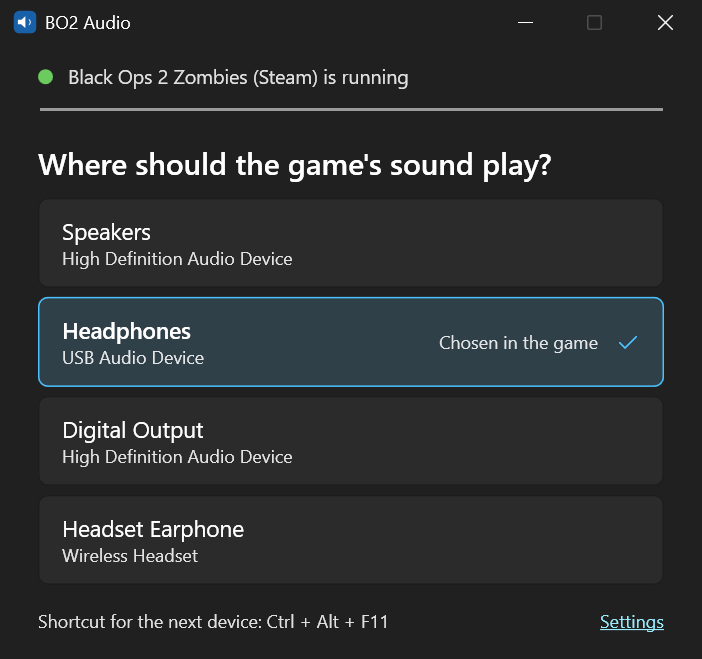

# bo2-audio-switcher

Switch the audio output device of Call of Duty: Black Ops 2 in the middle of a match.

The game greys out **Settings > Sound > Sound Device** while a match is running, and it does not follow a change of the Windows default device. If your headset dies mid-round, you have to quit the match to get sound somewhere else. This tool moves the game's sound to another device from outside the game.



It works with the Steam version (zombies and multiplayer) and with Plutonium.

## Requirements

- Windows 11, 64-bit. Windows 10 version 2004 or newer should work but is untested.
- [.NET 10 Desktop Runtime](https://dotnet.microsoft.com/download/dotnet/10.0) to run it, the .NET 10 SDK to build it

## Download

Get `bo2audio.exe` from the [latest release](https://github.com/qwerty084/bo2-audio-switcher/releases/latest). It is a single file you can put anywhere.

The exe is not code-signed. Windows SmartScreen may warn about an unknown publisher. Choose **More info > Run anyway**.

Each release exe is built by GitHub Actions from the tagged source. To check that your copy is that build, use the [GitHub CLI](https://cli.github.com/):

```
gh attestation verify bo2audio.exe -R qwerty084/bo2-audio-switcher
```

## Build

With the .NET 10 SDK installed:

```
pwsh publish.ps1
```

This writes `dist\bo2audio.exe`.

## Use

1. Start `bo2audio.exe`, before or after the game, and leave it open.
2. Once the game plays sound, click the device you want to hear it on.
3. To go back, click the device marked `Chosen in the game`, or close the window.

The bar at the top moves while the game makes sound.

A keyboard shortcut (default `Ctrl+Alt+F11`) switches to the next device without leaving the game, and beeps on the new device. Under **Settings** you can turn the shortcut off, change the keys, choose which devices it switches between, and turn the beep off.

The tool stores its settings in `%AppData%\bo2audio\settings.json`.

## How it works

The game opens its sound device once at startup and keeps it for the whole session. The tool does not change that. It records the game's sound with a Windows audio feature (WASAPI process loopback), plays it on the device you picked, and mutes the game's original device.

This has side effects:

- While redirecting, the tool mutes the game's original device for every app. Muting the game alone would also silence the recording.
- The original device must stay connected. If you unplug it, the game goes silent for the rest of the session.
- The sound arrives 30 to 60 ms later.

If you kill the tool while it redirects, the original device stays muted until you start the tool again. To keep track of this, it writes the muted device to `%AppData%\bo2audio\muted.txt` while it redirects.

## Anti-cheat

The tool does not inject code into the game, does not read or write the game's memory, and does not change game files. It uses Windows audio and hotkey APIs.

That is not a guarantee. I do not know how VAC or Plutonium's anti-cheat treat third-party tools. Use it at your own risk.

## License

[MIT](LICENSE)

This project is not affiliated with or endorsed by Activision, Treyarch or the Plutonium project. Call of Duty and Black Ops are trademarks of Activision Publishing, Inc.
